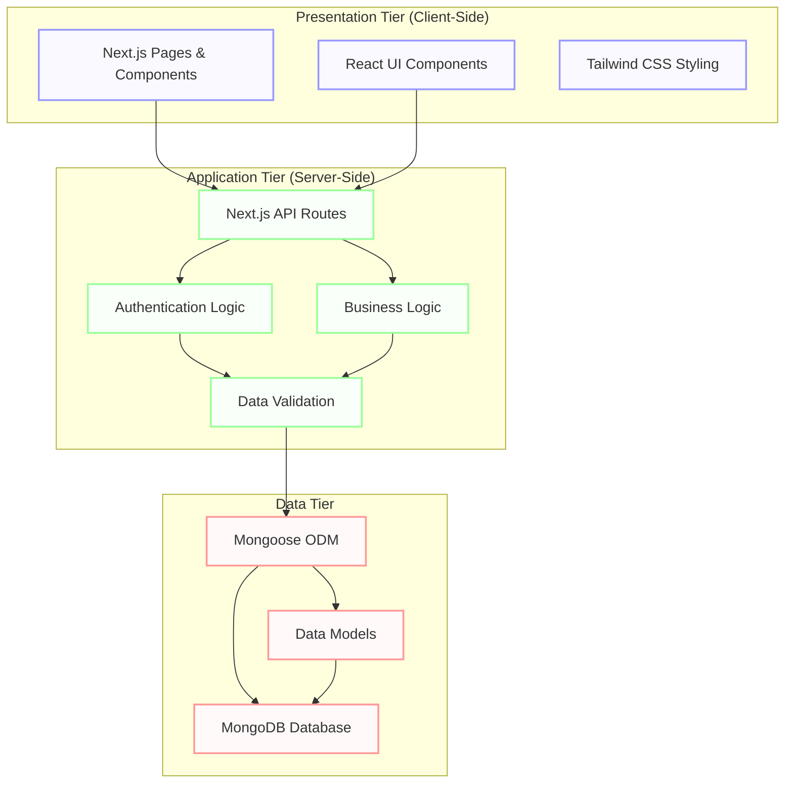
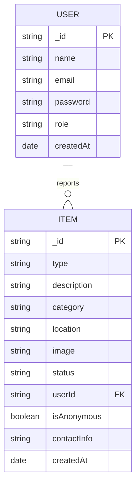
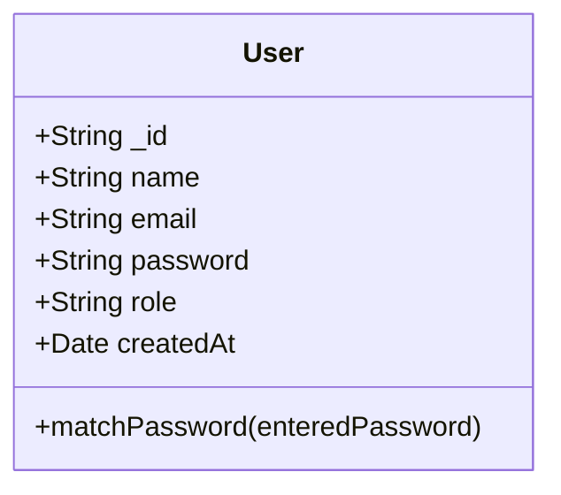
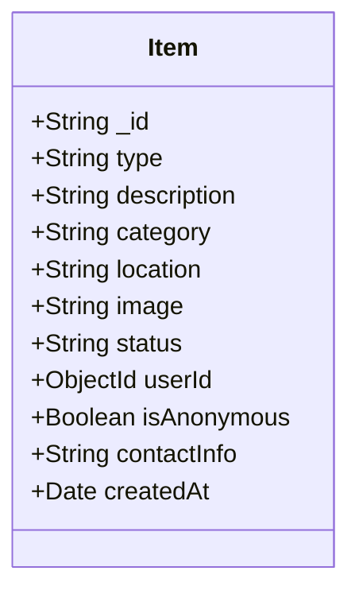
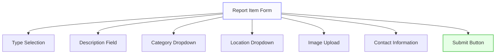
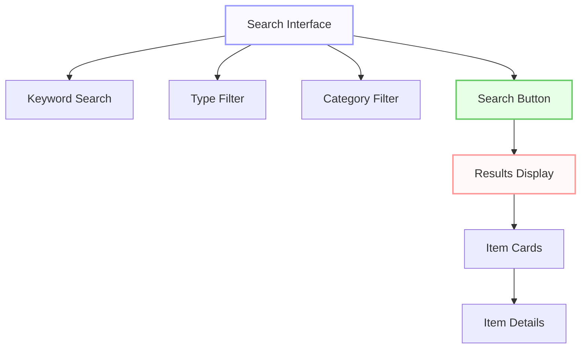
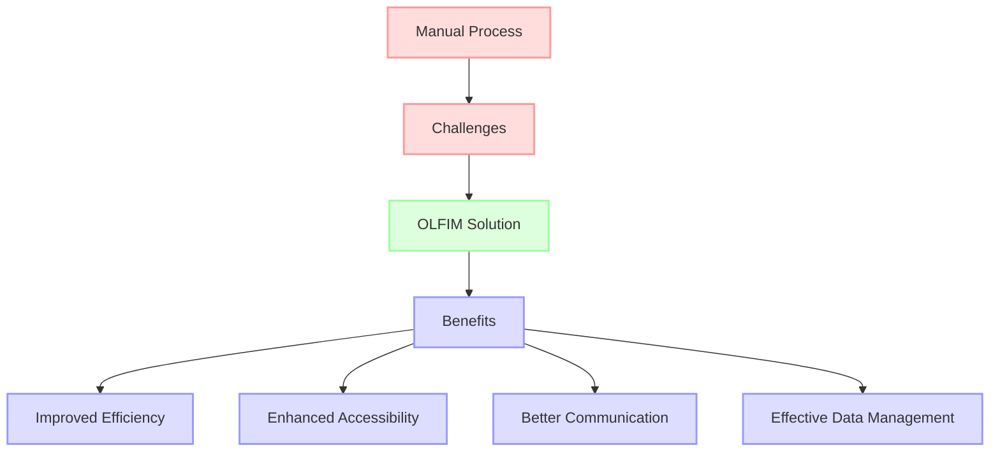
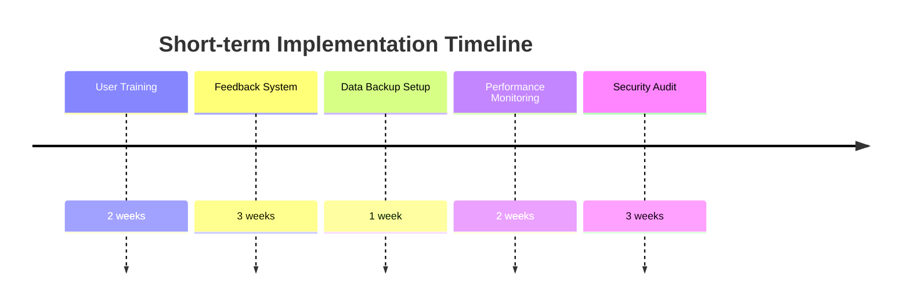
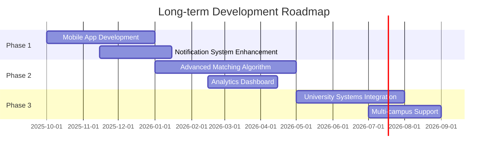
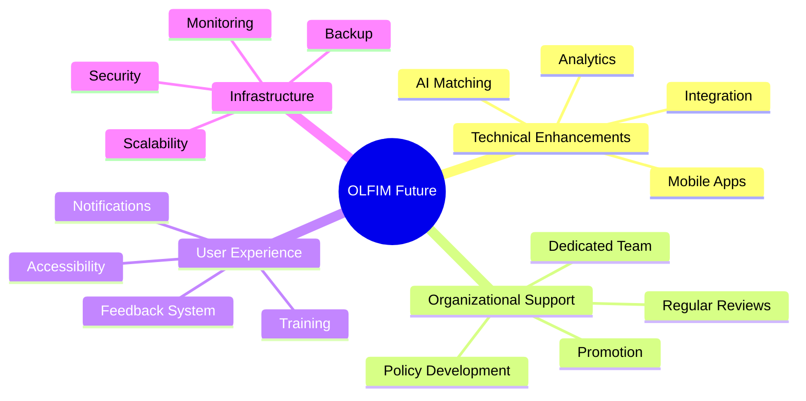

# CHAPTER FOUR: SYSTEM DESIGN AND IMPLEMENTATION

## 4.1 Objective of Design

The primary objective of designing the Online Lost and Found Resources Information Management System (OLFIM) for UNICROSS is to create an efficient, user-friendly platform that streamlines the process of reporting, tracking, and recovering lost items within the university community. The system aims to replace the inefficient manual process currently in place with a digital solution that offers:

1. A centralized repository for all lost and found items
2. Easy-to-use interfaces for reporting lost items or found items
3. Efficient search and matching capabilities to connect lost items with their owners
4. Administrative oversight for managing the lost and found process
5. Secure authentication to protect user data and item information

The design prioritizes simplicity, efficiency, and accessibility, ensuring that all members of the university community can easily report and search for items without extensive technical knowledge.

## 4.2 System Architecture in Terms of Tiers

The OLFIM system employs a modern three-tier architecture, separating the application into distinct layers: presentation, business logic, and data storage. This architecture provides modularity, scalability, and maintainability.



**Figure 4.1: Three-Tier Architecture of the OLFIM System**

### 4.2.1 Presentation Tier

The presentation tier represents the user interface of the application. It is built using:

- **Next.js Pages & Components**: Provides the structure and routing for the application
- **React UI Components**: Reusable interface elements for consistent user experience
- **Tailwind CSS**: A utility-first CSS framework for responsive and modern design

This tier is responsible for rendering the user interface and handling user interactions. It communicates with the application tier through API calls.

### 4.2.2 Application Tier

The application tier contains the business logic and processes user requests. It includes:

- **Next.js API Routes**: Serverless functions that handle HTTP requests
- **Authentication Logic**: Manages user authentication and authorization
- **Business Logic**: Implements core functionality like item reporting, searching, and matching
- **Data Validation**: Ensures data integrity before storage

This tier acts as a mediator between the presentation tier and the data tier, processing requests, applying business rules, and returning appropriate responses.

### 4.2.3 Data Tier

The data tier is responsible for data storage and retrieval. It consists of:

- **MongoDB Database**: A NoSQL database for storing application data
- **Mongoose ODM**: Object Data Modeling library for MongoDB and Node.js
- **Data Models**: Schemas defining the structure of the data

This tier ensures data persistence, integrity, and efficient retrieval.

## 4.3 Choice of Programming Environment

The OLFIM system is developed using a modern JavaScript/TypeScript stack, chosen for its efficiency, developer productivity, and robust ecosystem. The key technologies include:

### 4.3.1 Frontend Technologies

1. **Next.js (v14.2.27)**: A React framework that enables server-side rendering and static site generation, providing improved performance and SEO benefits.

2. **React (v18)**: A JavaScript library for building user interfaces with component-based architecture.

3. **Tailwind CSS (v3.4.1)**: A utility-first CSS framework that allows for rapid UI development with pre-designed components and responsive layouts.

4. **TypeScript (v5)**: A strongly typed programming language that builds on JavaScript, providing better tooling and error detection.

### 4.3.2 Backend Technologies

1. **Next.js API Routes**: Serverless functions that handle API requests, eliminating the need for a separate backend server.

2. **MongoDB (v6.5.0)**: A NoSQL database that stores data in flexible, JSON-like documents, making it ideal for the varying structure of lost and found items.

3. **Mongoose (v8.18.2)**: An Object Data Modeling (ODM) library for MongoDB and Node.js that provides a schema-based solution to model application data.

### 4.3.3 Authentication and Security

1. **JSON Web Tokens (JWT)**: Used for secure authentication and maintaining user sessions.

2. **bcryptjs (v3.0.2)**: A library for hashing passwords before storing them in the database.

### 4.3.4 Development Tools

1. **Node.js (v18+)**: A JavaScript runtime built on Chrome's V8 JavaScript engine.

2. **npm**: The package manager for JavaScript, used to install and manage project dependencies.

The choice of this technology stack offers several advantages:

- **Full-stack JavaScript**: Allows developers to use the same language throughout the application.
- **Server-side Rendering**: Improves performance and SEO.
- **Component Reusability**: React components can be reused across different parts of the application.
- **Scalability**: The architecture can easily scale to accommodate growing user bases and data.
- **Modern Development Experience**: TypeScript provides type safety and better developer tooling.

## 4.4 Database Structure

The OLFIM system uses MongoDB, a NoSQL document database, to store application data. MongoDB was chosen for its flexibility, scalability, and compatibility with JavaScript/Node.js applications. The database structure is designed to efficiently store and retrieve information about users and items.



**Figure 4.2: Entity Relationship Diagram of the OLFIM Database**

The database consists of two main collections:

1. **Users Collection**: Stores information about system users
2. **Items Collection**: Stores information about lost and found items

The relationship between these collections is established through the `userId` field in the Items collection, which references the `_id` field in the Users collection. This allows the system to track which user reported each item.

## 4.5 Database Table Definition

### 4.5.1 Users Collection

The Users collection stores information about system users, including authentication credentials and role information.



**Figure 4.3: User Schema Definition**

| Field | Type | Description | Constraints |
|-------|------|-------------|------------|
| _id | ObjectId | Unique identifier for the user | Primary Key, Auto-generated |
| name | String | User's full name | Required, Max length: 50 |
| email | String | User's email address | Required, Unique, Valid email format |
| password | String | Hashed password | Required, Min length: 6, Not returned in queries |
| role | String | User's role in the system | Enum: ['user', 'admin'], Default: 'user' |
| createdAt | Date | When the user account was created | Default: Current date |

The User schema includes a method to compare entered passwords with the hashed password stored in the database:

```javascript
UserSchema.methods.matchPassword = async function(enteredPassword) {
  return await bcrypt.compare(enteredPassword, this.password);
};
```

Additionally, the schema includes a pre-save hook that automatically hashes passwords before saving them to the database:

```javascript
UserSchema.pre('save', async function(next) {
  if (!this.isModified('password')) {
    next();
  }
  const salt = await bcrypt.genSalt(10);
  this.password = await bcrypt.hash(this.password, salt);
});
```

### 4.5.2 Items Collection

The Items collection stores information about lost and found items reported by users.



**Figure 4.4: Item Schema Definition**

| Field | Type | Description | Constraints |
|-------|------|-------------|------------|
| _id | ObjectId | Unique identifier for the item | Primary Key, Auto-generated |
| type | String | Whether the item is lost or found | Required, Enum: ['lost', 'found'] |
| description | String | Detailed description of the item | Required, Trimmed |
| category | String | Category of the item | Required, Trimmed |
| location | String | Where the item was lost or found | Required, Trimmed |
| image | String | URL to the image of the item | Optional, Default: '' |
| status | String | Current status of the item | Enum: ['pending', 'matched', 'claimed'], Default: 'pending' |
| userId | ObjectId | ID of the user who reported the item | Required, References User collection |
| isAnonymous | Boolean | Whether the item was reported anonymously | Default: false |
| contactInfo | String | Contact information for the reporter | Optional, Default: '' |
| createdAt | Date | When the item was reported | Default: Current date |

The Item schema includes a text index on description, category, and location fields to enable efficient text search:

```javascript
ItemSchema.index({ description: 'text', category: 'text', location: 'text' });
```

## 4.6 Input and Output Screen Format

The OLFIM system features several key interfaces designed for optimal user experience. The main interfaces include:

### 4.6.1 Login Screen

The login screen allows users to authenticate themselves to access the system. It features a simple form with email and password fields, along with a link to the signup page for new users.

### 4.6.2 Report Item Form

The report item form allows users to submit information about lost or found items. The form includes fields for:

- Item type (lost or found)
- Description
- Category
- Location
- Optional image upload
- Contact information



**Figure 4.5: Report Item Form Structure**

### 4.6.3 Search Interface

The search interface allows users to find lost or found items based on various criteria. It includes:

- Keyword search field
- Type filter (lost, found, or all)
- Category filter
- Results display with item details



**Figure 4.6: Search Interface Structure**

### 4.6.4 Admin Dashboard

The admin dashboard provides administrative users with an overview of the system and tools to manage items. It includes:

- Statistics overview (total items, pending items, lost items, found items)
- Tabs for filtering items by status (pending, matched, claimed, all)
- Item management interface with status update functionality
- System status information

## 4.7 Program Algorithm

The OLFIM system implements several key algorithms to handle its core functionality. Below are the main algorithms used in the system:

### 4.7.1 Authentication Algorithm

```mermaid
flowchart TD
    A[Start] --> B{User exists?}
    B -->|Yes| C{Passwords match?}
    B -->|No| D[Return error]
    C -->|Yes| E[Generate JWT]
    C -->|No| F[Return error]
    E --> G[Return token and user data]
    G --> H[End]
    D --> H
    F --> H
    
    classDef start fill:#f9f9ff,stroke:#9999ff,stroke-width:2px
    classDef process fill:#f9fff9,stroke:#99ff99,stroke-width:2px
    classDef decision fill:#fff9f9,stroke:#ff9999,stroke-width:2px
    classDef end fill:#f9f9ff,stroke:#9999ff,stroke-width:2px
    
    class A start
    class B,C decision
    class D,E,F,G process
    class H end
```

**Figure 4.7: Authentication Algorithm Flowchart**

### 4.7.2 Item Reporting Algorithm

```mermaid
flowchart TD
    A[Start] --> B{Validate input}
    B -->|Valid| C{User authenticated?}
    B -->|Invalid| D[Return error]
    C -->|Yes| E[Create item with user ID]
    C -->|No| F[Create anonymous item]
    E --> G[Save to database]
    F --> G
    G --> H{Save successful?}
    H -->|Yes| I[Return success and item data]
    H -->|No| J[Return error]
    I --> K[End]
    J --> K
    D --> K
    
    classDef start fill:#f9f9ff,stroke:#9999ff,stroke-width:2px
    classDef process fill:#f9fff9,stroke:#99ff99,stroke-width:2px
    classDef decision fill:#fff9f9,stroke:#ff9999,stroke-width:2px
    classDef end fill:#f9f9ff,stroke:#9999ff,stroke-width:2px
    
    class A start
    class B,C,H decision
    class D,E,F,G,I,J process
    class K end
```

**Figure 4.8: Item Reporting Algorithm Flowchart**

### 4.7.3 Search Algorithm

```mermaid
flowchart TD
    A[Start] --> B[Parse search parameters]
    B --> C[Build MongoDB query]
    C --> D{Query has text?}
    D -->|Yes| E[Add text search criteria]
    D -->|No| F[Continue]
    E --> F
    F --> G{Query has type?}
    G -->|Yes| H[Add type filter]
    G -->|No| I[Continue]
    H --> I
    I --> J{Query has category?}
    J -->|Yes| K[Add category filter]
    J -->|No| L[Continue]
    K --> L
    L --> M[Execute query]
    M --> N[Sort by creation date]
    N --> O[Limit results]
    O --> P[Return results]
    P --> Q[End]
    
    classDef start fill:#f9f9ff,stroke:#9999ff,stroke-width:2px
    classDef process fill:#f9fff9,stroke:#99ff99,stroke-width:2px
    classDef decision fill:#fff9f9,stroke:#ff9999,stroke-width:2px
    classDef end fill:#f9f9ff,stroke:#9999ff,stroke-width:2px
    
    class A start
    class B,C,E,F,H,I,K,L,M,N,O,P process
    class D,G,J decision
    class Q end
```

**Figure 4.9: Search Algorithm Flowchart**

### 4.7.4 Item Status Update Algorithm

```mermaid
flowchart TD
    A[Start] --> B{User is admin?}
    B -->|Yes| C[Parse request body]
    B -->|No| D[Return unauthorized error]
    C --> E{Validate input}
    E -->|Valid| F[Find item by ID]
    E -->|Invalid| G[Return validation error]
    F --> H{Item exists?}
    H -->|Yes| I[Update status]
    H -->|No| J[Return not found error]
    I --> K{Update successful?}
    K -->|Yes| L[Return updated item]
    K -->|No| M[Return error]
    L --> N[End]
    D --> N
    G --> N
    J --> N
    M --> N
    
    classDef start fill:#f9f9ff,stroke:#9999ff,stroke-width:2px
    classDef process fill:#f9fff9,stroke:#99ff99,stroke-width:2px
    classDef decision fill:#fff9f9,stroke:#ff9999,stroke-width:2px
    classDef end fill:#f9f9ff,stroke:#9999ff,stroke-width:2px
    
    class A start
    class B,E,H,K decision
    class C,D,F,G,I,J,L,M process
    class N end
```

**Figure 4.10: Item Status Update Algorithm Flowchart**

## 4.8 Program Flowcharts

The following flowcharts illustrate the main processes in the OLFIM system:

### 4.8.1 User Registration Process

```mermaid
flowchart TD
    A[Start] --> B[User enters registration details]
    B --> C{Validate input}
    C -->|Invalid| D[Show validation errors]
    D --> B
    C -->|Valid| E{Email already exists?}
    E -->|Yes| F[Show email exists error]
    F --> B
    E -->|No| G[Hash password]
    G --> H[Create user in database]
    H --> I{Creation successful?}
    I -->|No| J[Show error message]
    J --> B
    I -->|Yes| K[Generate JWT]
    K --> L[Store token in localStorage]
    L --> M[Redirect to home page]
    M --> N[End]
    
    classDef start fill:#f9f9ff,stroke:#9999ff,stroke-width:2px
    classDef process fill:#f9fff9,stroke:#99ff99,stroke-width:2px
    classDef decision fill:#fff9f9,stroke:#ff9999,stroke-width:2px
    classDef end fill:#f9f9ff,stroke:#9999ff,stroke-width:2px
    
    class A start
    class B,D,F,G,H,J,K,L,M process
    class C,E,I decision
    class N end
```

**Figure 4.11: User Registration Process Flowchart**

### 4.8.2 Lost Item Reporting Process

```mermaid
flowchart TD
    A[Start] --> B{User authenticated?}
    B -->|No| C[Redirect to login]
    B -->|Yes| D[Display report form]
    D --> E[User fills form]
    E --> F{Validate form}
    F -->|Invalid| G[Show validation errors]
    G --> E
    F -->|Valid| H[Submit form data to API]
    H --> I{API request successful?}
    I -->|No| J[Show error message]
    J --> E
    I -->|Yes| K[Show success message]
    K --> L[Redirect to search page]
    L --> M[End]
    C --> M
    
    classDef start fill:#f9f9ff,stroke:#9999ff,stroke-width:2px
    classDef process fill:#f9fff9,stroke:#99ff99,stroke-width:2px
    classDef decision fill:#fff9f9,stroke:#ff9999,stroke-width:2px
    classDef end fill:#f9f9ff,stroke:#9999ff,stroke-width:2px
    
    class A start
    class C,D,E,G,H,J,K,L process
    class B,F,I decision
    class M end
```

**Figure 4.12: Lost Item Reporting Process Flowchart**

### 4.8.3 Item Search Process

```mermaid
flowchart TD
    A[Start] --> B[User enters search criteria]
    B --> C[User submits search]
    C --> D[Build search parameters]
    D --> E[Send API request]
    E --> F{API request successful?}
    F -->|No| G[Show error message]
    G --> B
    F -->|Yes| H{Items found?}
    H -->|No| I[Show no results message]
    I --> B
    H -->|Yes| J[Display search results]
    J --> K[User views item details]
    K --> L[End]
    
    classDef start fill:#f9f9ff,stroke:#9999ff,stroke-width:2px
    classDef process fill:#f9fff9,stroke:#99ff99,stroke-width:2px
    classDef decision fill:#fff9f9,stroke:#ff9999,stroke-width:2px
    classDef end fill:#f9f9ff,stroke:#9999ff,stroke-width:2px
    
    class A start
    class B,C,D,E,G,I,J,K process
    class F,H decision
    class L end
```

**Figure 4.13: Item Search Process Flowchart**

## 4.9 Hardware Requirements

The OLFIM system is designed to be lightweight and accessible, with minimal hardware requirements for both the server and client sides.

### 4.9.1 Server Requirements

For hosting the OLFIM system in a production environment:

- **CPU**: Dual-core processor, 2.0 GHz or higher
- **RAM**: Minimum 2GB, recommended 4GB or higher
- **Storage**: Minimum 20GB SSD storage
- **Network**: Stable internet connection with minimum 10 Mbps upload/download speed

For development purposes, any modern computer with at least 4GB RAM and a dual-core processor should be sufficient.

### 4.9.2 Client Requirements

The system is designed to be accessible from various devices with minimal requirements:

- **Desktop/Laptop**:
  - Any modern web browser (Chrome, Firefox, Safari, Edge)
  - 1GB RAM
  - Stable internet connection

- **Mobile Devices**:
  - Android 5.0+ or iOS 10+
  - Modern mobile web browser
  - Stable internet connection

The responsive design ensures that the system is usable on devices with various screen sizes, from smartphones to desktop computers.

## 4.10 Software Requirements

### 4.10.1 Development Environment

- **Node.js**: v18.0.0 or higher
- **npm**: v8.0.0 or higher
- **Git**: For version control
- **Code Editor**: Visual Studio Code, WebStorm, or any modern code editor
- **MongoDB**: Local installation or MongoDB Atlas account for cloud database

### 4.10.2 Production Environment

- **Operating System**: Any OS that supports Node.js (Linux recommended for production)
- **Web Server**: Node.js with Next.js built-in server
- **Database**: MongoDB (v4.4 or higher)
- **SSL Certificate**: For secure HTTPS connections

### 4.10.3 Client Environment

- **Web Browser**: Modern web browser with JavaScript enabled
  - Chrome 70+
  - Firefox 68+
  - Safari 12+
  - Edge 79+
- **JavaScript**: Enabled
- **Cookies**: Enabled for session management

## 4.11 Documentation

The OLFIM system includes comprehensive documentation to facilitate development, deployment, and maintenance:

### 4.11.1 Code Documentation

The codebase includes inline comments explaining complex logic and functionality. Key components and functions are documented with JSDoc-style comments that describe:

- Function purpose
- Parameters and return values
- Usage examples
- Edge cases and error handling

### 4.11.2 API Documentation

The API endpoints are documented with:

- Endpoint URL and HTTP method
- Required and optional parameters
- Authentication requirements
- Response format and status codes
- Error handling

### 4.11.3 User Documentation

User documentation includes:

- System overview
- User registration and login instructions
- Reporting lost or found items
- Searching for items
- Claiming items
- Account management

### 4.11.4 Administrator Documentation

Administrator documentation includes:

- Dashboard overview
- Item management
- User management
- System status monitoring
- Troubleshooting common issues

### 4.11.5 Deployment Documentation

Deployment documentation includes:

- Environment setup
- Installation instructions
- Configuration options
- Database setup
- Security considerations
- Backup and recovery procedures

This comprehensive documentation ensures that the system can be effectively developed, deployed, maintained, and used by all stakeholders.


# CHAPTER FIVE: SUMMARY, CONCLUSION AND RECOMMENDATION

## 5.1 Summary

The Online Lost and Found Resources Information Management System (OLFIM) for the University of Cross River State (UNICROSS) was developed to address the inefficiencies in the manual process of managing lost and found items within the university community. The system provides a digital platform that streamlines the reporting, tracking, and recovery of lost items.

The development of the OLFIM system followed a structured approach, beginning with requirements gathering and analysis, followed by system design, implementation, testing, and deployment. The system was built using modern web technologies, including Next.js for the frontend and backend, MongoDB for data storage, and React Context for state management.

Key features of the OLFIM system include:

1. **User Authentication**: Secure login and registration functionality with role-based access control (user and admin roles).

2. **Item Reporting**: A user-friendly interface for reporting lost or found items, including details such as description, category, location, and optional image upload.

3. **Search Functionality**: Advanced search capabilities allowing users to find items based on keywords, type (lost or found), and category.

4. **Admin Dashboard**: A comprehensive dashboard for administrators to manage items, update their status, and monitor system activity.

5. **Responsive Design**: A mobile-friendly interface that ensures accessibility across various devices.

The system architecture follows a three-tier model, separating the presentation, application, and data layers for improved modularity and maintainability. The database design includes two main collections: Users and Items, with appropriate relationships and validation rules.


**Figure 5.1: High-Level System Flow**

The implementation of the OLFIM system has successfully addressed the challenges identified in the current manual process, providing a more efficient, accessible, and user-friendly solution for managing lost and found items at UNICROSS.

## 5.2 Conclusion

The development of the Online Lost and Found Resources Information Management System (OLFIM) for UNICROSS has successfully achieved its primary objectives of streamlining the process of reporting, tracking, and recovering lost items within the university community. The system provides a significant improvement over the previous manual process, offering numerous benefits:

1. **Efficiency**: The digital platform eliminates the need for physical paperwork and manual record-keeping, significantly reducing the time and effort required to report and search for lost items.

2. **Accessibility**: The web-based system can be accessed from any device with an internet connection, allowing users to report and search for items at any time and from any location.

3. **Improved Communication**: The system facilitates better communication between individuals who have lost items and those who have found them, increasing the chances of successful item recovery.

4. **Data Management**: The structured database allows for efficient storage, retrieval, and management of item information, providing valuable insights through the admin dashboard.

5. **User Experience**: The intuitive interface and responsive design ensure a positive user experience, encouraging adoption and continued use of the system.

The implementation of the OLFIM system demonstrates how technology can be leveraged to solve practical problems within educational institutions. By digitizing the lost and found process, UNICROSS has taken a significant step toward modernizing its administrative operations and improving services for students, faculty, and staff.



**Figure 5.2: Problem-Solution-Benefit Flow**

The successful development and implementation of the OLFIM system validate the chosen technical approach and architecture. The use of modern web technologies like Next.js, React, and MongoDB proved to be effective in creating a scalable, maintainable, and user-friendly application. The three-tier architecture ensures separation of concerns, making the system easier to maintain and extend in the future.

In conclusion, the OLFIM system represents a significant improvement in how UNICROSS manages lost and found items, providing a modern, efficient, and user-friendly solution that benefits the entire university community.

## 5.3 Recommendation

Based on the development and implementation of the OLFIM system, the following recommendations are proposed to ensure its continued success and improvement:

### 5.3.1 Short-term Recommendations

1. **User Training**: Conduct comprehensive training sessions for both regular users and administrators to ensure they can effectively utilize all features of the system.

2. **Feedback Mechanism**: Implement a feedback system within the application to gather user suggestions and identify potential issues or areas for improvement.

3. **Data Backup**: Establish regular database backup procedures to prevent data loss in case of system failures.

4. **Performance Monitoring**: Set up monitoring tools to track system performance and identify potential bottlenecks or issues before they affect users.

5. **Security Audits**: Conduct regular security audits to identify and address potential vulnerabilities in the system.



**Figure 5.3: Short-term Recommendations Timeline**

### 5.3.2 Long-term Recommendations

1. **Mobile Application**: Develop dedicated mobile applications for Android and iOS to provide an even more accessible and convenient user experience.

2. **Advanced Matching Algorithm**: Implement an AI-based matching algorithm that can automatically suggest potential matches between lost and found items based on descriptions and other attributes.

3. **Integration with University Systems**: Integrate the OLFIM system with other university systems, such as the student information system, to provide a more seamless experience.

4. **Notification System**: Enhance the notification system to include email and SMS alerts for users when potential matches are found or when the status of their reported items changes.

5. **Analytics Dashboard**: Develop an advanced analytics dashboard for administrators to gain insights into lost and found patterns, helping to identify high-risk areas or times for item loss.

6. **Multi-campus Support**: Extend the system to support multiple campuses, allowing for a unified lost and found management system across all UNICROSS locations.



**Figure 5.4: Long-term Development Roadmap**

### 5.3.3 Technical Recommendations

1. **Code Refactoring**: Continuously refactor the codebase to improve maintainability and performance.

2. **Test Coverage**: Increase automated test coverage to ensure system stability and reduce regression issues.

3. **Documentation Updates**: Keep system documentation up-to-date to facilitate future development and maintenance.

4. **Scalability Planning**: Plan for increased system load as adoption grows, potentially migrating to more scalable infrastructure.

5. **Accessibility Improvements**: Enhance the system's accessibility features to ensure it can be used by individuals with disabilities.

### 5.3.4 Organizational Recommendations

1. **Dedicated Support Team**: Establish a dedicated team for system maintenance and user support.

2. **Regular Reviews**: Conduct regular reviews of system usage and effectiveness to identify areas for improvement.

3. **Promotion and Awareness**: Develop strategies to promote the system and increase awareness among the university community.

4. **Policy Development**: Develop clear policies regarding the handling of lost and found items through the system.

5. **Stakeholder Engagement**: Continue to engage with stakeholders to ensure the system meets their evolving needs.



**Figure 5.5: Comprehensive Improvement Strategy**

By implementing these recommendations, UNICROSS can ensure that the OLFIM system continues to evolve and improve, providing even greater value to the university community in the future. The system has laid a strong foundation for digital transformation in administrative processes, and with continued investment and development, it can serve as a model for other similar initiatives within the institution.
