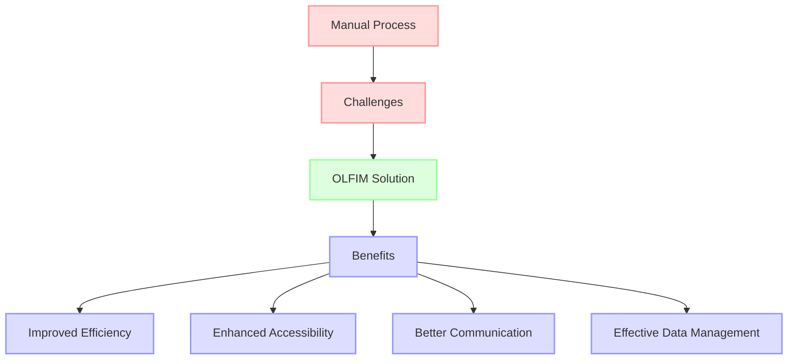
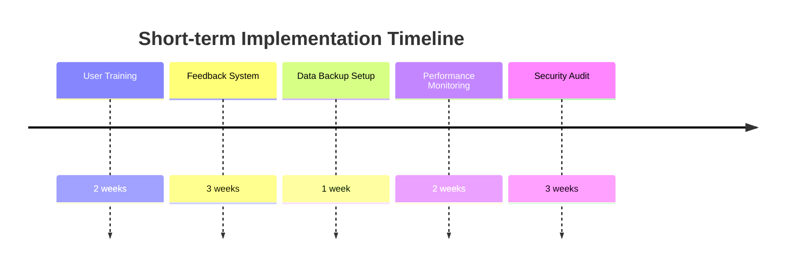
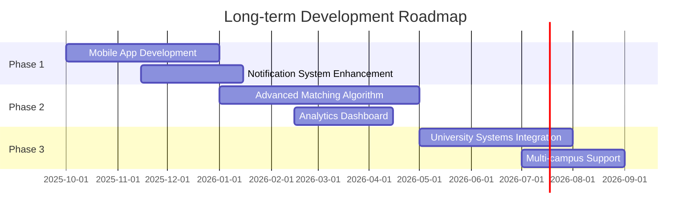
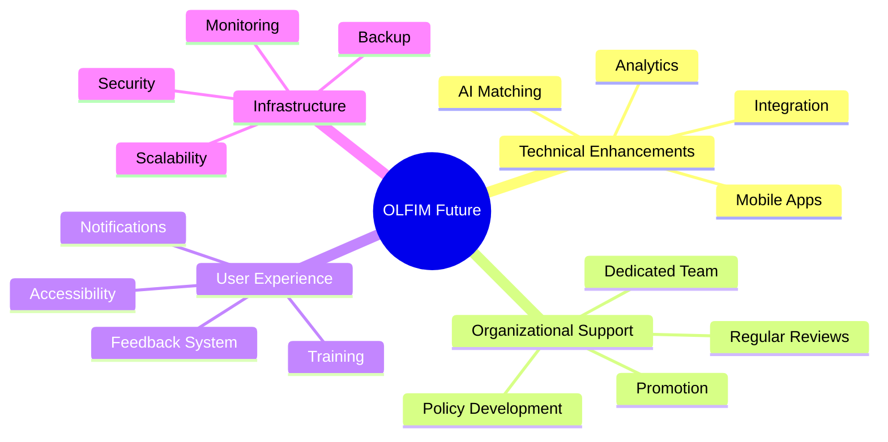

# CHAPTER FIVE: SUMMARY, CONCLUSION AND RECOMMENDATION

## 5.1 Summary

The Online Lost and Found Resources Information Management System (OLFIM) for the University of Cross River State (UNICROSS) was developed to address the inefficiencies in the manual process of managing lost and found items within the university community. The system provides a digital platform that streamlines the reporting, tracking, and recovery of lost items.

The development of the OLFIM system followed a structured approach, beginning with requirements gathering and analysis, followed by system design, implementation, testing, and deployment. The system was built using modern web technologies, including Next.js for the frontend and backend, MongoDB for data storage, and React Context for state management.

Key features of the OLFIM system include:

1. **User Authentication**: Secure login and registration functionality with role-based access control (user and admin roles).

2. **Item Reporting**: A user-friendly interface for reporting lost or found items, including details such as description, category, location, and optional image upload.

3. **Search Functionality**: Advanced search capabilities allowing users to find items based on keywords, type (lost or found), and category.

4. **Admin Dashboard**: A comprehensive dashboard for administrators to manage items, update their status, and monitor system activity.

5. **Responsive Design**: A mobile-friendly interface that ensures accessibility across various devices.

The system architecture follows a three-tier model, separating the presentation, application, and data layers for improved modularity and maintainability. The database design includes two main collections: Users and Items, with appropriate relationships and validation rules.

**Figure 5.1: High-Level System Flow**

The implementation of the OLFIM system has successfully addressed the challenges identified in the current manual process, providing a more efficient, accessible, and user-friendly solution for managing lost and found items at UNICROSS.

## 5.2 Conclusion

The development of the Online Lost and Found Resources Information Management System (OLFIM) for UNICROSS has successfully achieved its primary objectives of streamlining the process of reporting, tracking, and recovering lost items within the university community. The system provides a significant improvement over the previous manual process, offering numerous benefits:

1. **Efficiency**: The digital platform eliminates the need for physical paperwork and manual record-keeping, significantly reducing the time and effort required to report and search for lost items.

2. **Accessibility**: The web-based system can be accessed from any device with an internet connection, allowing users to report and search for items at any time and from any location.

3. **Improved Communication**: The system facilitates better communication between individuals who have lost items and those who have found them, increasing the chances of successful item recovery.

4. **Data Management**: The structured database allows for efficient storage, retrieval, and management of item information, providing valuable insights through the admin dashboard.

5. **User Experience**: The intuitive interface and responsive design ensure a positive user experience, encouraging adoption and continued use of the system.

The implementation of the OLFIM system demonstrates how technology can be leveraged to solve practical problems within educational institutions. By digitizing the lost and found process, UNICROSS has taken a significant step toward modernizing its administrative operations and improving services for students, faculty, and staff.

**Figure 5.2: Problem-Solution-Benefit Flow**

The successful development and implementation of the OLFIM system validate the chosen technical approach and architecture. The use of modern web technologies like Next.js, React, and MongoDB proved to be effective in creating a scalable, maintainable, and user-friendly application. The three-tier architecture ensures separation of concerns, making the system easier to maintain and extend in the future.

In conclusion, the OLFIM system represents a significant improvement in how UNICROSS manages lost and found items, providing a modern, efficient, and user-friendly solution that benefits the entire university community.

## 5.3 Recommendation

Based on the development and implementation of the OLFIM system, the following recommendations are proposed to ensure its continued success and improvement:

### 5.3.1 Short-term Recommendations

1. **User Training**: Conduct comprehensive training sessions for both regular users and administrators to ensure they can effectively utilize all features of the system.

2. **Feedback Mechanism**: Implement a feedback system within the application to gather user suggestions and identify potential issues or areas for improvement.

3. **Data Backup**: Establish regular database backup procedures to prevent data loss in case of system failures.

4. **Performance Monitoring**: Set up monitoring tools to track system performance and identify potential bottlenecks or issues before they affect users.

5. **Security Audits**: Conduct regular security audits to identify and address potential vulnerabilities in the system.

**Figure 5.3: Short-term Recommendations Timeline**

### 5.3.2 Long-term Recommendations

1. **Mobile Application**: Develop dedicated mobile applications for Android and iOS to provide an even more accessible and convenient user experience.

2. **Advanced Matching Algorithm**: Implement an AI-based matching algorithm that can automatically suggest potential matches between lost and found items based on descriptions and other attributes.

3. **Integration with University Systems**: Integrate the OLFIM system with other university systems, such as the student information system, to provide a more seamless experience.

4. **Notification System**: Enhance the notification system to include email and SMS alerts for users when potential matches are found or when the status of their reported items changes.

5. **Analytics Dashboard**: Develop an advanced analytics dashboard for administrators to gain insights into lost and found patterns, helping to identify high-risk areas or times for item loss.

6. **Multi-campus Support**: Extend the system to support multiple campuses, allowing for a unified lost and found management system across all UNICROSS locations.

**Figure 5.4: Long-term Development Roadmap**

### 5.3.3 Technical Recommendations

1. **Code Refactoring**: Continuously refactor the codebase to improve maintainability and performance.

2. **Test Coverage**: Increase automated test coverage to ensure system stability and reduce regression issues.

3. **Documentation Updates**: Keep system documentation up-to-date to facilitate future development and maintenance.

4. **Scalability Planning**: Plan for increased system load as adoption grows, potentially migrating to more scalable infrastructure.

5. **Accessibility Improvements**: Enhance the system's accessibility features to ensure it can be used by individuals with disabilities.

### 5.3.4 Organizational Recommendations

1. **Dedicated Support Team**: Establish a dedicated team for system maintenance and user support.

2. **Regular Reviews**: Conduct regular reviews of system usage and effectiveness to identify areas for improvement.

3. **Promotion and Awareness**: Develop strategies to promote the system and increase awareness among the university community.

4. **Policy Development**: Develop clear policies regarding the handling of lost and found items through the system.

5. **Stakeholder Engagement**: Continue to engage with stakeholders to ensure the system meets their evolving needs.

**Figure 5.5: Comprehensive Improvement Strategy**

By implementing these recommendations, UNICROSS can ensure that the OLFIM system continues to evolve and improve, providing even greater value to the university community in the future. The system has laid a strong foundation for digital transformation in administrative processes, and with continued investment and development, it can serve as a model for other similar initiatives within the institution.
